  

<h3 align="center">🚀 Graduate Student | 💻 Full Stack Developer | ☁️ Cloud Enthusiast</h3>

  
  
  

  

## 🚀 About Me
I'm a passionate Computer Science graduate student at Stony Brook University, with a strong foundation in software development and a keen interest in cutting-edge technologies. My journey in tech has led me from Chennai, India to New York, USA, where I'm constantly pushing the boundaries of what's possible in software engineering.
## 🎓 Education
- Master of Science in Computer Science - Stony Brook University (Aug 2023 – May 2025)
- Bachelor of Engineering in Computer Science - Anna University (July 2019 – Apr 2023)
<table>
  <tr>
    <td>🏫 Stony Brook University</td>
    <td>📍 Stony Brook, NY</td>
    <td>🎓 Master of Science in Computer Science</td>
    <td>📅 Aug 2023 – May 2025</td>
  </tr>
  <tr>
    <td>🏫 Anna University</td>
    <td>📍 Chennai, India</td>
    <td>🎓 Bachelor of Engineering in Computer Science</td>
    <td>📅 July 2019 – Apr 2023</td>
  </tr>
</table>

## 💼 Professional Experience
### Project Trainee @ Zoho Corporation
Jan 2023 – Feb 2023
- 🔒 Enhanced data privacy with AES encryption and OAuth2.0 with JWT
- 🛠️ Improved app stability, resulting in a 10% uplift in resilience and UX
### Summer Intern @ Zoho Corporation
Apr 2022 – Jun 2022
- 🚀 Developed Cliq-Atlassian Jira integration plugin, boosting project throughput by 20%
- 📈 Expanded user base by 5,000 through strategic plugin launch
### Landing Page Team Lead @ Google Season of Docs - Wechaty
May 2021 – Nov 2021
- 🎨 Led redesign of Wechaty's landing page, increasing site traffic by 35%
- 🏎️ Achieved 94% Lighthouse performance score and 0.8s page load time
## 🛠️ Technical Skills

```mermaid
graph TD
    A[Technical Skills] --> B[Languages]
    A --> C[Frameworks/Libraries]
    A --> D[Databases and Tools]
    A --> E[DevOps/Cloud Services]
    A --> F[Other Technologies]

    B --> B1[Python]
    B --> B2[Go]
    B --> B3[Ruby]
    B --> B4[C/C++]
    B --> B5[JavaScript/TypeScript]

    C --> C1[React]
    C --> C2[Ruby on Rails]
    C --> C3[Node.js]
    C --> C4[Express.js]
    C --> C5[GraphQL]

    D --> D1[MySQL]
    D --> D2[Redis]
    D --> D3[MongoDB]
    D --> D4[PostgreSQL]
    D --> D5[Elasticsearch]

    E --> E1[Docker]
    E --> E2[Kubernetes]
    E --> E3[AWS]
    E --> E4[Azure]
    E --> E5[Git]

    F --> F1[RESTful APIs]
    F --> F2[OAuth]
    F --> F3[JWT]
    F --> F4[TLS]
    F --> F5[gRPC]
```

  
  
  
  
  
  
  
  
  
  
  
  
  

## 🏗️ Featured Projects
### GoFlow
Go, RabbitMQ, PostgreSQL, MongoDB, Docker, Kubernetes
- 🚀 Engineered microservices architecture with 99.9% uptime
- 📊 Optimized system messaging, achieving 30% faster processing
### CodeCollab
React.js, Express.js, Node.js, GraphQL, MongoDB, Docker, Kubernetes, Azure
- 👥 Real-time collaborative coding platform
- 🔧 Supports 5K concurrent sessions with 25% faster load times
### StreamlineOps
Go, Ruby on Rails, Redis, PostgreSQL, Docker, Kubernetes, AWS
- 🔗 Developed API gateway, reducing backend load by 60%
- ☁️ Achieved 99.95% uptime using AWS CloudFormation
## 📈 GitHub Stats

  

## 🌟 Let's Connect!

  
  
<em>I love connecting with different people! Feel free to say hi! 👋</em>

  
  

---

💻 Code with passion. Build with purpose. 🚀

  

