# 👋 Hello, I'm Sajen Sarvajith Karthikeyan

  

## 🚀 About Me

I'm a passionate Computer Science graduate student at Stony Brook University, with a strong foundation in software development and a keen interest in cutting-edge technologies. My journey in tech has taken me across continents, from the vibrant streets of Chennai to the bustling energy of New York.

🌍 My Global Journey: 🇮🇳 India ✈️ 🇺🇸 USA

  

## 🎓 Education

- **Master of Science in Computer Science** - Stony Brook University (Aug 2023 – May 2025)
- **Bachelor of Engineering in Computer Science** - Anna University (July 2019 – Apr 2023)

## 💼 Professional Experience

  

### Project Trainee @ Zoho Corporation
*Jan 2023 – Feb 2023*
- 🔒 Enhanced data privacy with AES encryption and OAuth2.0 with JWT
- 🛠️ Improved app stability, resulting in a 10% uplift in resilience and UX

### Summer Intern @ Zoho Corporation
*Apr 2022 – Jun 2022*
- 🚀 Developed Cliq-Atlassian Jira integration plugin, boosting project throughput by 20%
- 📈 Expanded user base by 5,000 through strategic plugin launch

### Landing Page Team Lead @ Google Season of Docs - Wechaty
*May 2021 – Nov 2021*
- 🎨 Led redesign of Wechaty's landing page, increasing site traffic by 35%
- 🏎️ Achieved 94% Lighthouse performance score and 0.8s page load time

## 🛠️ Technical Skills

```mermaid
graph TD
    A[Technical Skills] --> B[Languages]
    A --> C[Frameworks/Libraries]
    A --> D[Databases and Tools]
    A --> E[DevOps/Cloud Services]
    A --> F[Other Technologies]

    B --> B1[Python]
    B --> B2[Go]
    B --> B3[Ruby]
    B --> B4[C/C++]
    B --> B5[JavaScript/TypeScript]

    C --> C1[React]
    C --> C2[Ruby on Rails]
    C --> C3[Node.js]
    C --> C4[Express.js]
    C --> C5[GraphQL]

    D --> D1[MySQL]
    D --> D2[Redis]
    D --> D3[MongoDB]
    D --> D4[PostgreSQL]
    D --> D5[Elasticsearch]

    E --> E1[Docker]
    E --> E2[Kubernetes]
    E --> E3[AWS]
    E --> E4[Azure]
    E --> E5[Git]

    F --> F1[RESTful APIs]
    F --> F2[OAuth]
    F --> F3[JWT]
    F --> F4[TLS]
    F --> F5[gRPC]
```

  

## 🏗️ Featured Projects

  

### GoFlow
*Go, RabbitMQ, PostgreSQL, MongoDB, Docker, Kubernetes*
- 🚀 Engineered microservices architecture with 99.9% uptime
- 📊 Optimized system messaging, achieving 30% faster processing

### CodeCollab
*React.js, Express.js, Node.js, GraphQL, MongoDB, Docker, Kubernetes, Azure*
- 👥 Real-time collaborative coding platform
- 🔧 Supports 5K concurrent sessions with 25% faster load times

### StreamlineOps
*Go, Ruby on Rails, Redis, PostgreSQL, Docker, Kubernetes, AWS*
- 🔗 Developed API gateway, reducing backend load by 60%
- ☁️ Achieved 99.95% uptime using AWS CloudFormation

## 📈 GitHub Stats

## 🌟 Let's Connect!

  
  
<em>I love connecting with different people! Feel free to say hi! 👋</em>

I'm always open to interesting conversations and collaboration opportunities. Feel free to reach out!

---

💻 Code with passion. Build with purpose. 🚀

  

